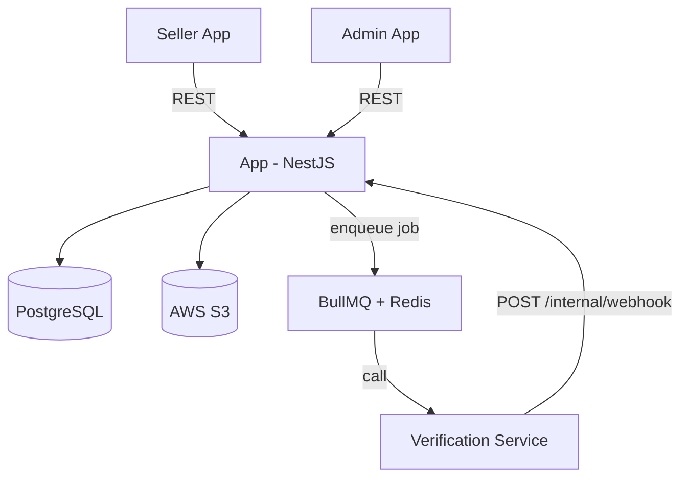

## Functional Requirements

### Seller
- Seller can upload documents
- Document after verification will has status: verified, rejected, inconclusive
- Seller can receive noti result + optional reason (by email)
- Seller can re-upload only when status is `rejected` (new record created)
- Seller cannot see `error` status, API returns `processing` until admin retries

### Admin
- Admin can make final call when inconclusive
- Admin can see full history: automated and manual, including who did what, when.
- Admin can retry verification if error
- Admin can see count of documents by status (error, inconclusive, etc.)

### System
- Mock verification service returns random result with variable delay

---

## Non-Functional Requirements

**Performance**
- API response < 500ms
- Queue processes 100 jobs/minute

**Scalability**
- System must handle burst of 5,000 sellers/week without dropping jobs

**Reliability**
- Idempotency: never call external service twice for the same document

**Security**
- File upload must validate type/size
- Role-based access: sellers see only their own data, admins see all
- Never leak internal errors in responses

**Observability**
- Full audit log for every state transition

---
## DB Schema

### users
| Column       | Type                        | Constraints         |
|--------------|-----------------------------|---------------------|
| id           | uuid                        | PK                  |
| email        | varchar                     | UNIQUE NOT NULL     |
| password_hash| varchar                     | NOT NULL            |
| name         | varchar                     | NOT NULL            |
| role         | enum(seller, admin)         | NOT NULL            |
| status       | enum(active, deleted)       | NOT NULL DEFAULT active |
| created_at   | timestamp                   | NOT NULL            |
| updated_at   | timestamp                   | NOT NULL            |

**Indexes:**
- `email` — covered by UNIQUE constraint

### documents
| Column          | Type                                                    | Constraints              |
|-----------------|---------------------------------------------------------|--------------------------|
| id              | uuid                                                    | PK                       |
| user_id         | uuid                                                    | FK → users.id NOT NULL   |
| verification_id | varchar                                                 | nullable                 |
| job_id          | varchar                                                 | nullable (BullMQ job id) |
| file_url        | varchar                                                 | NOT NULL                 |
| file_name       | varchar                                                 | NOT NULL                 |
| file_size       | integer                                                 | NOT NULL (bytes)         |
| status          | enum(processing, verified, rejected, inconclusive, error) | NOT NULL DEFAULT processing |
| created_at      | timestamp                                               | NOT NULL                 |
| updated_at      | timestamp                                               | NOT NULL                 |

**Indexes:**
- `user_id` — seller list own docs
- `status` — admin filter/count; no `user_id` in query so composite unusable
- `verification_id` — webhook idempotency
- `(user_id, status)` — seller list by status

### audit_logs
| Column      | Type                    | Constraints                |
|-------------|-------------------------|----------------------------|
| id          | uuid                    | PK                         |
| document_id | uuid                    | FK → documents.id NOT NULL |
| action_type | enum(auto, manual)      | NOT NULL                   |
| actor_id    | uuid                    | nullable FK → users.id     |
| actor_type  | enum(system, admin, seller) | NOT NULL               |
| prev_status | varchar                 | nullable                   |
| next_status | varchar                 | NOT NULL                   |
| reason      | text                    | nullable                   |
| created_at  | timestamp               | NOT NULL                   |

**Indexes:**
- `document_id` — audit history lookup per document


--------

## State Machine — Verification Record

```
                  ┌─────────────┐
                  │  PROCESSING │ ◄── seller uploads (created directly as PROCESSING + enqueue job)
                  │             │ ◄── admin retry
                  └──────┬──────┘
       ┌─────────────────┼──────────────┬──────────────┐
       ▼                 ▼              ▼              ▼
  ┌──────────┐  ┌─────────────┐  ┌──────────┐  ┌───────────┐
  │ VERIFIED │  │ INCONCLUSIVE│  │ REJECTED │  │   ERROR   │
  │ [FINAL]  │  │             │  │ [FINAL]  │  │           │
  └──────────┘  └──────┬──────┘  └──────────┘  └─────┬─────┘
                  admin review                   admin decides
                ┌──────┴──────┐              ┌────────┴────────┐
                ▼             ▼              ▼                 ▼
           VERIFIED       REJECTED       PROCESSING        REJECTED
           [FINAL]        [FINAL]        (retry)           [FINAL]

Terminal states: VERIFIED, REJECTED

```

---

## Notification

- Channel: email (SMTP)
- Trigger: terminal state transition — verified, rejected

## High-Level Architecture



---

## API Endpoints

### Auth
| Method | Path        | Role | Description |
|--------|-------------|------|-------------|
| POST   | /auth/login | *    | Login |

### Seller
| Method | Path               | Role   | Description             |
|--------|--------------------|--------|-------------------------|
| POST   | /documents         | seller | Upload document         |
| GET    | /documents         | seller | List own documents      |
| GET    | /documents/:id     | seller | Get document status     |

### Admin
| Method | Path                           | Role  | Description              |
|--------|--------------------------------|-------|--------------------------|
| GET    | /admin/documents               | admin | List all (filter status) |
| GET    | /admin/documents/:id           | admin | Get document detail      |
| GET    | /admin/documents/stats         | admin | Count by status (error, inconclusive, ...) |
| POST   | /admin/documents/:id/review    | admin | Resolve inconclusive     |
| POST   | /admin/documents/:id/retry     | admin | Retry error              |
| GET    | /admin/documents/:id/audit-logs| admin | Full audit history of a document |

### Internal (server-to-server)
| Method | Path               | Description                    |
|--------|--------------------|--------------------------------|
| POST   | /internal/webhook  | Callback from mock service     |

---

## Data Flow — Launch Week (5,000 sellers)

```
5,000 sellers upload
        │
        ▼
  ┌───────────┐    
  │   Queue   │
  │  (Redis)  │
  └───────────┘
        │
        │ drain  100 jobs/min
        ▼
  Rate Limiter ──► ~50 minutes
        │
        ▼
  External Service ($2/call) ──► ~$10,000 
        │
        ▼                           
  Result stored + notify seller      
```

---

## Exception Handling

### Error Matrix

| Error | Cause | Action |
|---|---|---|
| 429 Too Many Req | BullMQ misconfigured / external bug | DELAY 60s, does not count as attempt |
| 5xx / Timeout / Network | External service down | Retry exponential backoff (30s → 60s → 120s → exhausted) |
| Retries Exhausted | Persistent failure sau 4 attempts | status = ERROR, job → failed set (DLQ), notify admin |

### Retry Flow

```
Worker picks job
      │
      ▼
Call External Service
      │
      ├── 2xx ──────────────► update status (verified/rejected/inconclusive)
      │
      ├── 429 ──────────────► DELAY 60s, does not count as attempt
      │                       BullMQ auto-resumes
      │
      ├── 5xx/timeout ──────► exponential backoff retry
      │                       attempt 1 → wait 30s
      │                       attempt 2 → wait 60s
      │                       attempt 3 → wait 120s
      │                       attempt 4 → exhausted
      │                            │
      │                            ▼
      │                       status = ERROR
      │                       job → DLQ (Redis failed set)
      │                       notify admin
      │
      └── Unexpected ────────► same as 5xx
```